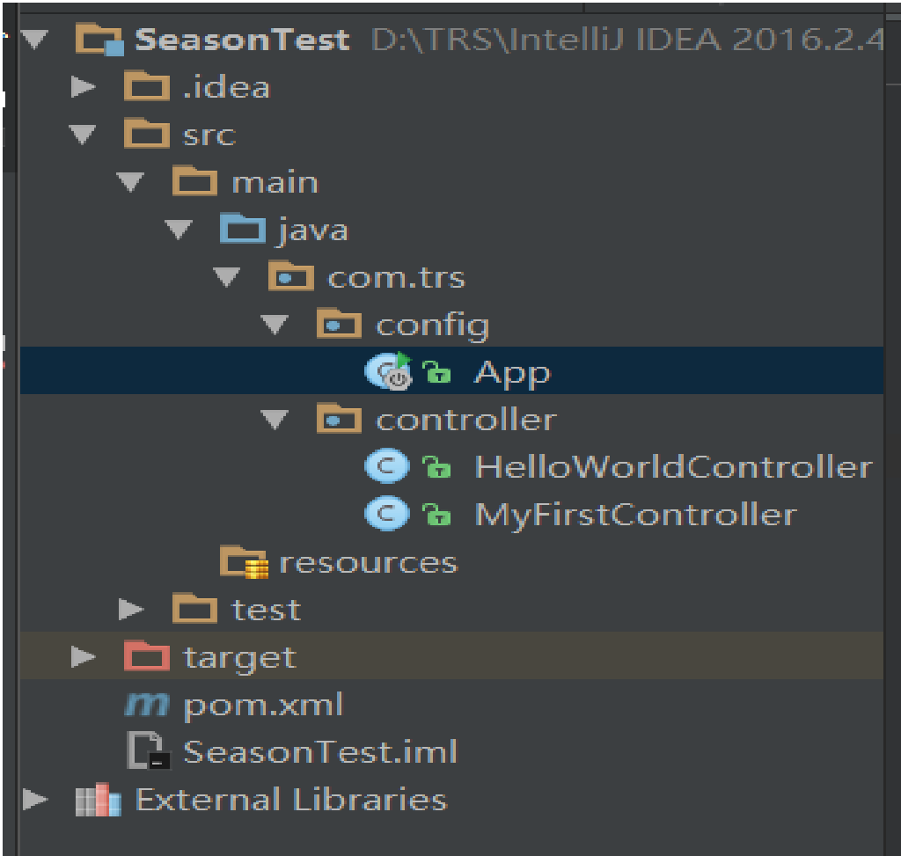
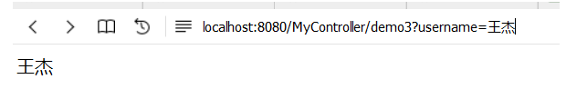
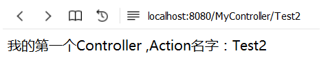

# Study2

# Season项目目录结构图


# 创建Controller步骤
1、新建Controller类，
   继承自Controller（com.season.core.Controller）,
   并添加注解@ControllerKeym注解。
   新建类所属的包名必须以com开头(因为Season默认配置的Spring扫描包为com)
   
   详见下：
```java
package com.trs.controller;

import com.season.core.ActionKey;
import com.season.core.Controller;
import com.season.core.ControllerKey;

/**
 * Created by wangjie on 2016/10/10 0010.
 */
@ControllerKey(value = "MyController",viewPath = "MyFirstController")
public class MyFirstController extends Controller{

    public void demo(){
        renderText("我的第一个Controller ,Action名字：demo");
    }

    @ActionKey("Test2")
    public void demo2(){
        renderText("我的第一个Controller ,Action名字：Test2");
    }

    public void demo3(){
        String Str=getPara("username","请求中不存在username参数！");
        renderHtml(Str);
    }

}
```
Controller以及在其中定义的public无参方法称为一个Action。Action是请求的最小单位。Action 方法必须在 Controller 中声明,
该方法必须是 public 可见性且没有形参。Controller上必须添加ControllerKey注解，用于指定nameSpace和viewPath，nameSpace必填，
如果没有指定viewPath，则viewPath就是nameSpace。同时Spring Bean的名称也为nameSpace。

# 调用方式：
   http://localhost:8080/MyController/demo
   即：http://localhost:8080/namsapce/action；
   
# 调用效果图
   
   
